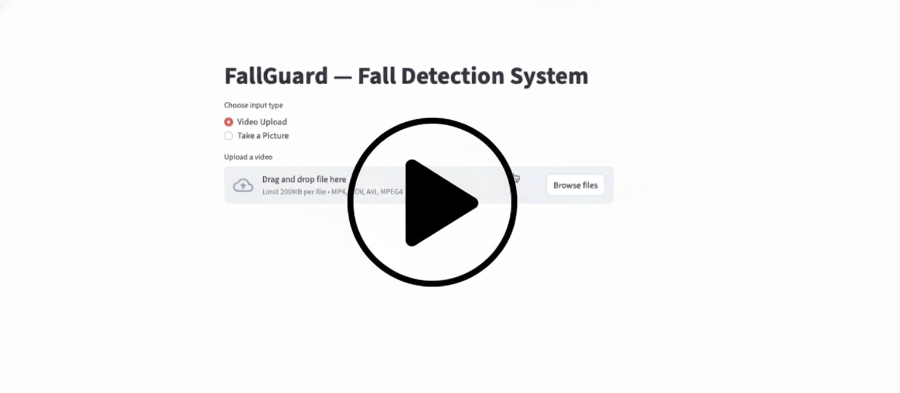

# FallGuard — Video-Based Fall Detection System

FallGuard is an end-to-end computer vision system that detects whether a person is **standing or has fallen** from images or video. It performs **bounding-box localization** and **posture classification** using a custom-trained deep learning model built with TensorFlow.

🎥 **Demo Video** [](assets/fallguard_demo.mp4)

---

## 🚀 Live Demo
🔗 Streamlit App: [https://fallguard-defi.streamlit.app](https://fallguard-defi.streamlit.app)

> ⚠️ **Note:** The live demo runs on CPU-only infrastructure (Streamlit Community Cloud). Real-time inference may be slower than local GPU execution. A recorded demo video is provided above to showcase full performance.

---

## ✨ Features
- **Real-time Detection:** High-accuracy fall vs. stand classification.
- **Spatial Localization:** Bounding-box detection of the subject.
- **Multi-Modal Input:** Supports webcam capture, image uploads, and MP4 video files.
- **Dynamic UI:** Adjustable confidence thresholds via an interactive Streamlit dashboard.

---

## 🖼️ Live Inference (Streamlit App)


---

## 🧠 Model Overview
- **Backbone:** MobileNetV2 (pretrained on ImageNet).
- **Dual-Output Heads:** - **Bounding-box regression:** Predicts spatial coordinates ($x_{min}, y_{min}, x_{max}, y_{max}$).
  - **Binary classification:** Predicts posture state (Fall / Stand).
- **Framework:** TensorFlow (tf.keras).

The model was trained on a dataset of **~7,000 annotated images** with custom preprocessing and coordinate normalization to ensure stable localization and accurate predictions.


---

## 📊 Training & Performance
- **Custom Pipeline:** Data pipeline featuring bounding-box normalization.
- **Optimization:** Joint optimization of localization (Regression) and classification losses.
- **Accuracy:** Achieved **~99% classification accuracy** with reliable spatial localization.


**Technical Note on Training Curves:**
As shown in the `training_metrics.png`, the **Training Loss** (blue line) demonstrates a smooth and stable convergence toward zero. The spike in **Validation Loss** (orange line) at Epoch 3 represents a temporary variance often caused by learning rate overshooting or validation batch noise. However, the model successfully recovered by Epoch 4, confirming strong generalization capabilities.

---

## 🛠 Tech Stack
- **Language:** Python
- **DL Framework:** TensorFlow (tf.keras)
- **Computer Vision:** OpenCV
- **Deployment:** Streamlit
- **Analysis:** NumPy

---

## 🏗 Running Locally

### 1. Install dependencies
```bash
pip install -r requirements.txt
