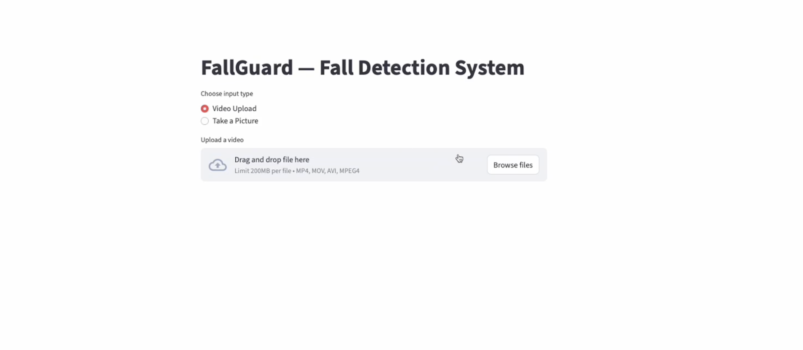
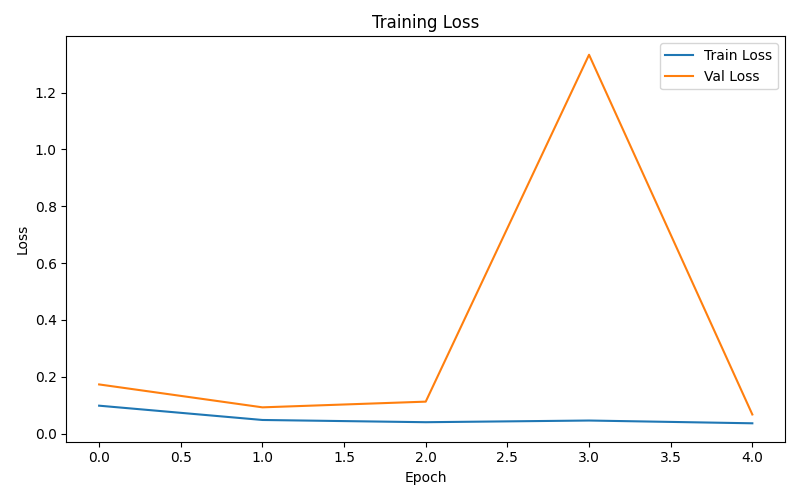

# FallGuard — Video-Based Fall Detection System

FallGuard is an end-to-end computer vision system that detects whether a person is **standing or has fallen** from images or video.  
It performs **bounding-box localization** and **posture classification** using a custom-trained deep learning model built with TensorFlow.

🎥 **Demo Video**  
[](assets/fallguard_demo.mp4)

---

## Live Demo
🔗 Streamlit App: https://fallguard-defi.streamlit.app

> ⚠️ Note: The live demo runs on CPU-only infrastructure (Streamlit Community Cloud).  
> Real-time inference may be slower than local GPU execution.  
> A recorded demo video is provided above to showcase full performance.

---

## Features
- Real-time fall vs. stand detection
- Bounding-box localization
- Image capture (webcam) and image upload
- Video upload with frame-by-frame inference
- Adjustable confidence threshold
- Interactive Streamlit web interface

---

## Live Inference (Streamlit App)


---

## Model Overview
- **Backbone:** MobileNetV2 (pretrained on ImageNet)
- **Heads:**
  - Bounding-box regression (xmin, ymin, xmax, ymax)
  - Binary classification (fall / stand)
- **Framework:** TensorFlow (tf.keras)

The model was trained on a dataset of ~7,000 annotated images with custom preprocessing and coordinate normalization to ensure stable localization and accurate predictions.

---

## Training
- Custom data pipeline with bounding-box normalization
- Joint optimization of localization and classification losses
- Achieved ~99% classification accuracy with reliable spatial localization



---

## Tech Stack
- Python
- TensorFlow (tf.keras)
- OpenCV
- Streamlit
- NumPy

---

## Running Locally

### Install dependencies
```bash
pip install -r requirements.txt
